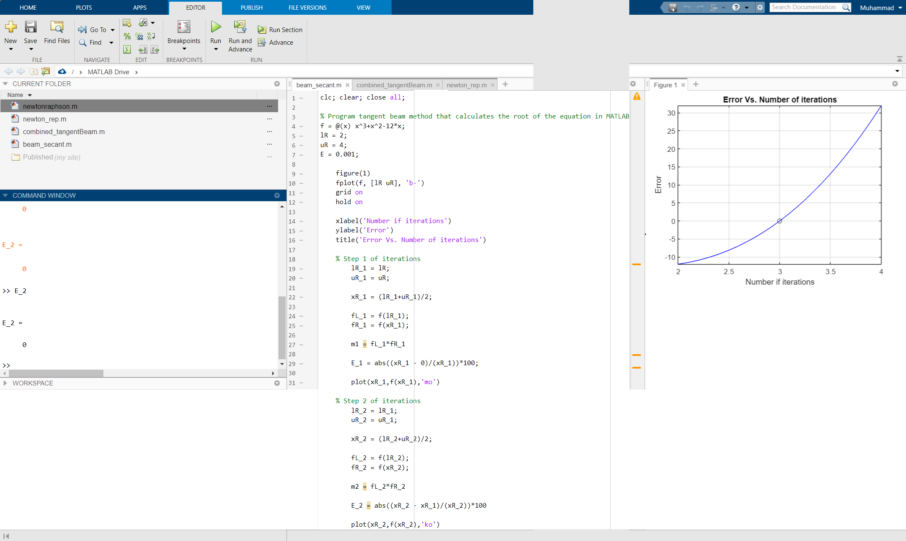
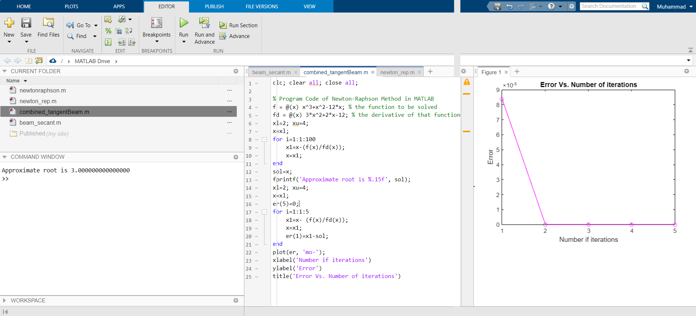

# Nonlinear Equation Solutions
## Open Methods
### Tangent-Beam Combined Method

#### Assignment 1:
Write the MATLAB code for the tangent-beam method that calculates the root of the equation x ^ 3 + x ^ 2-12x = 0 in the range [2, 4] with an error margin of h = 0.001.

### Newton Raphson Solution 1

### Newton Raphson Solution 2

