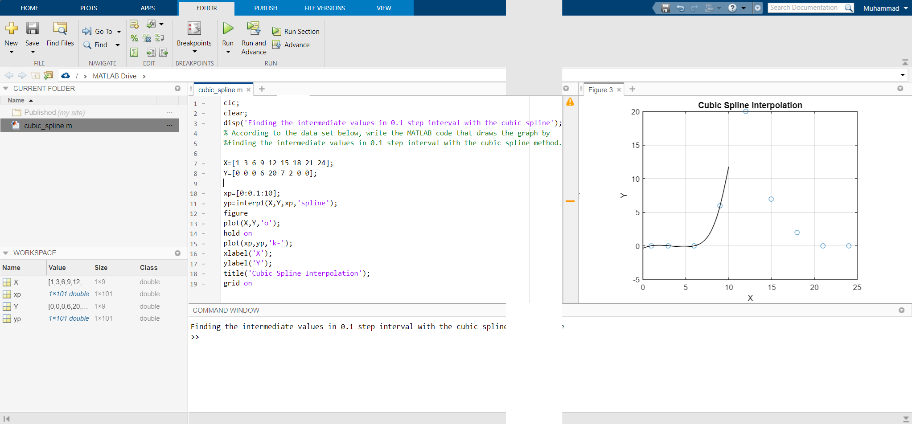

# Cubic Spline

#### Assignment 2:
According to the data set below, write the MATLAB code that draws the graph by finding the intermediate values ​​in 0.1 step interval with the cubic spline method .

x = [1 3 6 9 12 15 18 21 24];

y = [0 0 0 6 20 7 2 0 0];

### Solution

