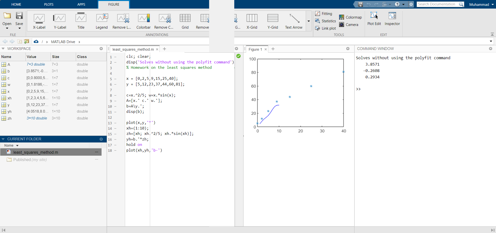

# Homework on the least squares method

#### Assignment 4:
Write the MATLAB codes in a general way that solves the homework question (without using the polyfit command) on the 16th page of the slide I have uploaded.

### Solution

